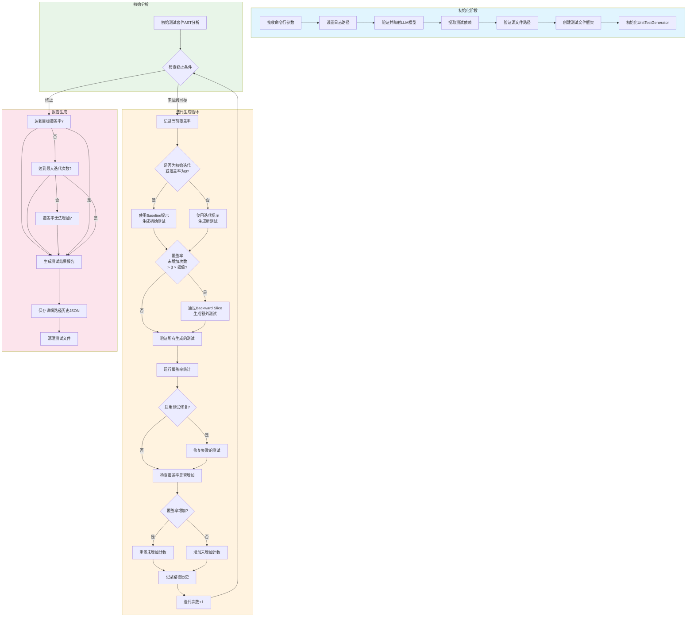

### 流程图说明

**1. 初始化阶段 (Initialization)**
- 接收并解析命令行参数
- 配置日志系统
- 验证LLM模型可用性
- 提取项目测试依赖
- 创建测试类框架（JUnit 3/4/5）
- 初始化测试生成器

**2. 初始分析 (Initial Analysis)**
- 对源代码进行AST分析
- 建立初始覆盖率和未覆盖代码映射

**3. 迭代生成循环 (Iterative Generation Loop)**
- **终止条件**: 达到目标覆盖率 OR 达到最大迭代次数 OR 覆盖率无法继续增加
- **测试生成**:
  - 初始迭代: 使用Baseline提示模板
  - 后续迭代: 基于未覆盖代码和执行路径生成针对性测试
  - Backward Slice: 当常规迭代无法提升覆盖率时，使用代码逆向切片技术
- **测试验证**: 编译、运行、收集覆盖率
- **可选修复**: 对失败的测试进行修复

**4. 报告生成 (Report Generation)**
- 生成HTML格式测试结果报告
- 保存详细路径历史用于分析
- 清理临时测试文件
